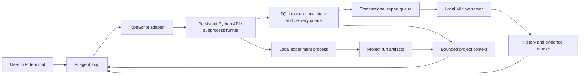
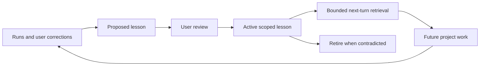

# Architecture

Remote experiments use `src/godel/remote.py` for durable registration and explicit
result import, exposed through the CLI API and Pi's `godel_remote_run` tool.
The agent owns external execution and verifies job/version provenance. The harness
snapshots source, enforces session run/candidate budgets, validates imported results
with the local runner's result validator, and uses the existing MLflow outbox.
It does not enforce remote wall-clock limits or independently query remote status.
No remote credentials or project-specific training logic enter this module.

## Execution path

Pi owns conversation, model calls, compaction, branching, and the terminal.
Python owns project structure, persisted metadata, experiment execution and
context selection. The adapter sends JSON to the private persistent Python bridge; experiments use
the cancellable Python subprocess path. It does not contain a second agent
loop. A future browser UI can use Pi RPC while retaining the Python core.

## Ownership and isolation

The harness repository owns reusable behavior and templates. A project's Git
repository owns code, tests, dependencies, evaluation design and reports.
The harness does not edit its own runtime during ordinary ML problem solving.

The local `.godel/pi/` directory is Pi's complete agent configuration directory.
The launcher sets it explicitly, removes inherited credential variables, disables
automatic resource discovery and supplies the exact extension, prompts and
repository-owned skill entrypoints. Sessions
use the current project's `.godel/sessions/`. Global auth/config is never imported
automatically. A user-requested provider import copies only the selected provider,
its authentication and model defaults; runtime loading remains local.
The adapter accesses the Python core through an absolute workspace entrypoint.

`HOME` and `PATH` retain their host meaning so normal local development tools
work. Their own caches/configuration and the host filesystem can be used by
commands. Godel's self-contained state is not an OS-level restriction, hermetic
environment, or guarantee that commands have no external side effects.

## Durable state and recovery

- `project.json`: versioned project identity, tags, evaluation definition and
  recorded-run limits. `brief.md` holds the human meaning and decisions.
- SQLite schema 3: checkpoints, lesson acceptance/review state, run metadata,
  evidence links, ordered history IDs/hashes and transactional delivery queues.
  Acknowledged conversation payloads live only in MLflow. Unknown future schema
  versions fail closed; existing checkpoint and lesson rows are preserved.
- Run directories: original execution output, source snapshots, metrics and artifacts.
  SQLite owns operational run queries; MLflow provides experiment reporting.
- MLflow: authoritative conversation traces and experiment tracking under root
  `mlflow/`. One `godel / <project-name>` experiment contains each project's
  conversation sessions and training runs; both exporters share the persisted
  project-to-experiment mapping. A request becomes a trace with event spans, grouped by Pi session ID.
  The Python worker sends deterministic OTLP span IDs, verifies payload hashes
  through MLflow's read API, then deletes pending/legacy event bodies. Retries do
  not rerun tools. A completed root span closes each request.
- Python bridge: private workspace Unix socket, persistent process, asynchronous
  export and bounded in-memory retrieval cache. Recording has no MLflow network
  dependency. Experiments retain the cancellable subprocess path.
- Pi JSONL: rebuildable runtime cache for resume/branch/compaction compatibility.
  Snapshots are stored in MLflow at turn/lifecycle boundaries; missing cache files
  are restored before chat. A hard crash between snapshots can leave newer data
  only in the native cache; migration resnapshots it. Existing cache files are
  never overwritten. No new Godel JSONL journals are appended.
- History tools: MLflow full-text prefilter followed by exact event filtering,
  stable sequence cursors, full payload chunk retrieval and evidence links.
  Queued records remain readable; MLflow outages are reported explicitly.

The current checkpoint is project-wide. Pi forks share project files, runs and
lessons. For competing code variants, use separate project copies or add an
explicit Git worktree workflow later. Simultaneous experiments in one project
are rejected using an OS file lock. Different projects can run independently.

Timeouts and cancellation stop the experiment's process group and save a final
status. A hard host crash or SIGKILL can leave `status: running`; that record is
unfinished and never eligible for a best-result comparison. Inspect its PID,
logs and files before recovery; do not blindly re-execute side-effecting work.
OS file locks release when the owning process exits.

Back up the entire workspace, including ignored `.godel/` directories, with the
processes stopped. Git alone does not back up credentials, lessons, sessions,
data or run artifacts. Keep such backups private.

`godel history [project]` lists session IDs and the MLflow UI link without reading
their content into model context. Completed message text and tool results are
retained; streaming partial tokens are not individually logged. Image binaries
remain in native Pi transcripts. Provider credential dialogs are not intercepted.
There is no automatic retention cleanup or training-data export; curate and
redact selected examples before using them outside the workspace.

## Experiments

An input is a hypothesis, argv list, explicit source paths, timeout and optional
parent run ID. Pi adds the session ID and model identity. The runner enforces
the per-run timeout and per-session run count for this API; those limits do not
constrain arbitrary host shell usage or model token cost.

Child processes receive an explicit basic environment, excluding inherited
provider credentials. They get `GODEL_RUN_DIR` and run from the project root.
Dependency/compute-specific environment injection is intentionally not a generic
credential passthrough; add it through a reviewed interface when a task needs it.

Snapshots are capped at 4 MiB and must be code/config files within the project.
Combined console output is capped at 2 MiB and records truncation. Metrics must
be a regular JSON file under 64 KiB containing finite numeric values and the
declared primary metric. These caps do not bound arbitrary artifact files,
CPU/RAM/GPU usage or external services. Experiments are never automatically retried;
only MLflow exports are retried. See [tracking](tracking.md) for storage,
parameters, metric curves, evidence links and service recovery.

Process outcome and measurement validity are independent. Nonzero exits,
timeouts and cancellations cannot become best results even if a metrics file
exists. Comparisons require equal dataset, split, metric and direction.
These are provenance aids; dataset/split IDs and computed metrics still need
independent validation in each project's evaluator.

`review.py` checks optional candidate/fold evidence and saved split membership.
It keeps numeric validity separate from evidence consistency and never certifies
independence or promotion. The runner records the review, and context reviews old
artifacts before ranking scores. `godel_review` and `godel review` expose read-only
diagnostics and paired comparisons. An optional candidate ceiling is enforced
under the same experiment lock, separately from the process-count ceiling.
See [the contract and limitations](model-development.md).

Context also refreshes the short `agent/model-development.md` foundation (2,500
characters) and the project's `protocol.md` (6,000 characters), with explicit
missing/truncation flags. Detailed workflows live in `agent/skills/*/SKILL.md`.
The launcher retains `--no-skills` and supplies each bundled entrypoint explicitly
with `--skill`. Pi exposes descriptions in its catalog and the agent reads full
instructions/references only when relevant. Skill paths in fresh context support
sessions opened before the catalog was installed. Skill bodies are not injected
into every turn. Startup provenance includes entrypoints, Markdown references
and Python skill helpers.
Recent runs include hypotheses, results and parent IDs; cumulative candidate
exposure stays visible for the current evaluation, the declared dataset across
evaluation changes, and the project total. Recent runs include their evaluation
definitions; dataset aliases/overlap remain a protocol responsibility. These are
exposure counts, not remaining authorization. Existing projects and sessions are not rewritten. An open
session receives refreshed guidance on its next turn; new adapter tools require
reloading/reopening Pi. The CLI review works immediately.

## Adaptation

`/teach` records an explicit user instruction as an active project lesson.
Agent-generated lessons begin as proposals. `/accept` activates them;
`/retire` removes them from retrieval while retaining history. Shared lessons
require tags and only match projects carrying those tags.

Retrieval uses scope, tags and a small lexical ranking, with a maximum of five
lessons and a 4,000-character payload budget. It deliberately requires no vector
database. The full evidence remains available in storage. This makes context
adaptation inspectable and reversible, but does not demonstrate quality gains.

The runtime's full host permissions mean review is an operator workflow, not an
adversarial approval gate. A future unattended/sandboxed version needs separate
authority for execution and promotion if that becomes a requirement.
